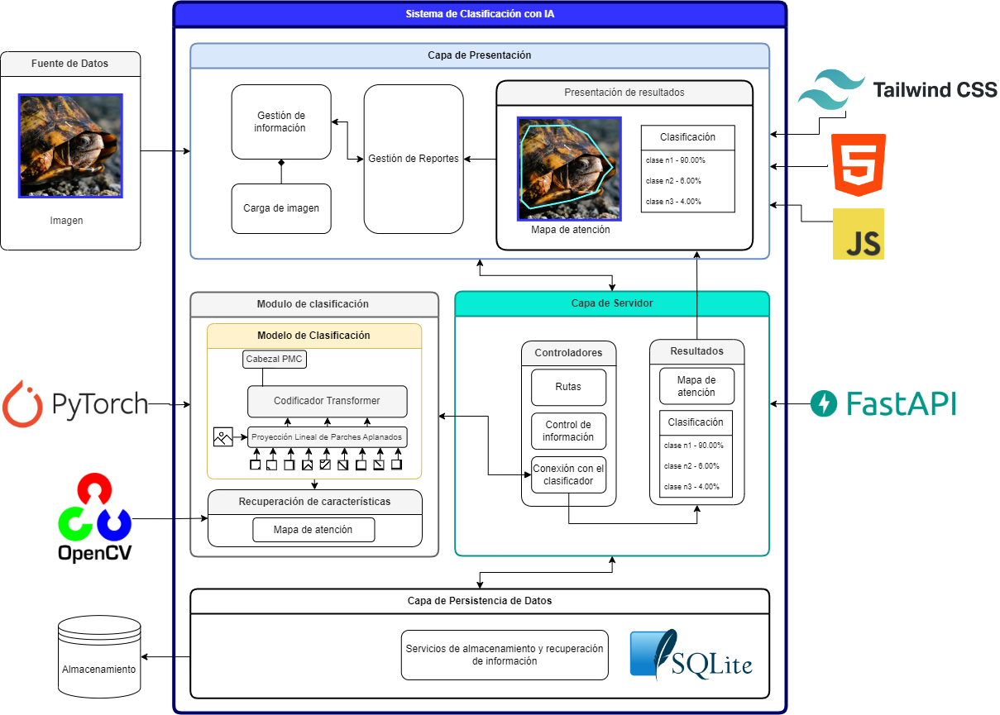

# Sistema de Clasificación con IA - Species Catalogue

Sistema para la clasificacion de especies mediante vision artificial. La aplicación recibe una imagen por parte del usuario, esta se envia a un modelo de clasificacion (ViT, SwinTransformer, BEiT, etc...) y este regresa una clasicacion junto con las áreas de atensión consideradas para obtener su conclusión. Permite ademas, llevar un registro de las especies catalogadas.

